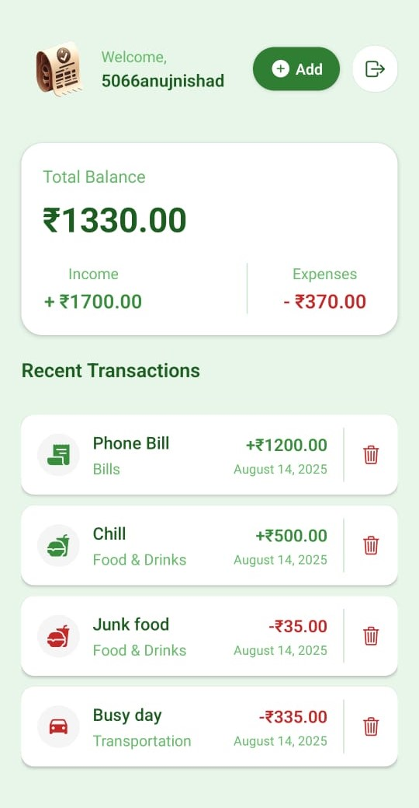
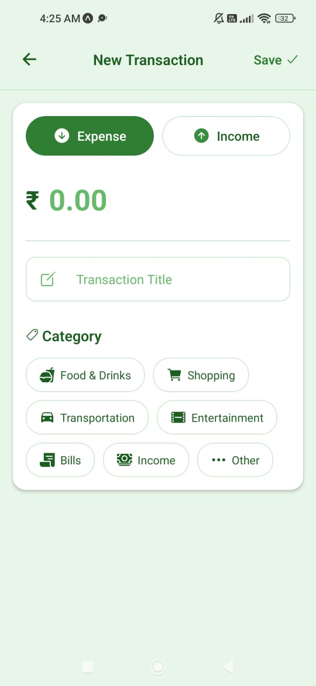

# Expense Tracker App

A **React Native** app built with **Expo** to help users track their **income** and **expenses** efficiently. It allows users to sign up, log in, verify email, create transactions, and view a summary of their finances in a dashboard.

---

## Features

- **User Authentication** with **Clerk**
- **Track Income & Expenses**
- **Dashboard** showing a summary of transactions
- **Add new transactions** (income or expense)
- **Email verification** after signup
- **Persistent backend** using **PostgreSQL** and **Prisma**

---

## Screenshots

### 1. Sign Up

### 2. Sign In

### 3. Verify Email

### 4. Dashboard

### 5. Create Transaction

---

## Tech Stack

- **Frontend:** React Native with Expo
- **Authentication:** Clerk
- **Backend:** PostgreSQL with Prisma ORM
- **State Management:** React Hooks
- **Styling:** Tailwind CSS

---
